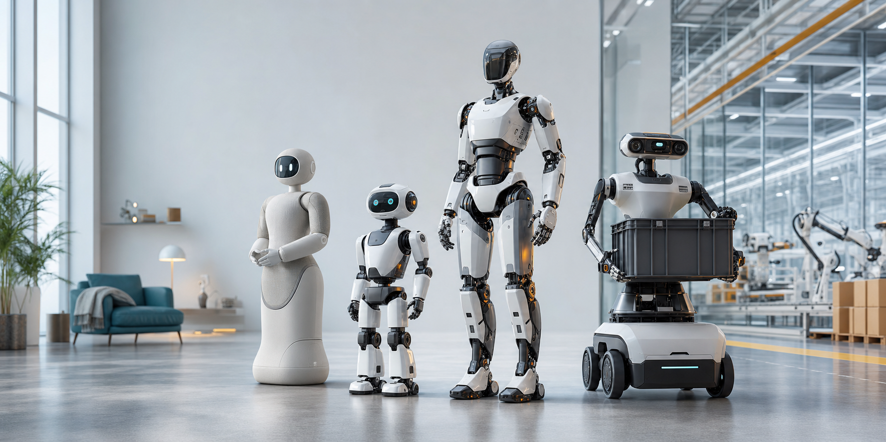

# 2026년 지금 가장 주목할 최신 휴머노이드 로봇 모델들

2026년 6월 10일 기준으로 로봇 업계의 분위기는 확실히 달라졌다. 몇 년 전까지만 해도 휴머노이드 로봇은 “걷는다”, “손을 흔든다”, “상자를 든다”는 시연 중심이었다. 지금은 질문이 바뀌었다. 어느 모델이 실제 공장과 물류센터에 들어갔는가, 어느 모델이 가정용으로 예약 판매를 시작했는가, 그리고 어느 회사가 양산과 유지보수까지 감당할 수 있는가.

이번 글에서는 최근 공개되었거나 상용화 단계에 가까워진 최신 로봇 모델들을 중심으로 정리했다. 단, 아직 대부분은 스마트폰처럼 바로 사서 쓰는 제품이 아니라 파일럿, 기업용 배치, 초기 접근 프로그램 단계에 가깝다.

## 한눈에 보는 최신 로봇 모델

| 모델 | 회사 | 핵심 포지션 | 현재 주목 포인트 |
|---|---|---|---|
| Figure 03 | Figure AI | 가정과 범용 작업 | Helix 기반 3세대 휴머노이드, 가정 작업 중심 설계 |
| NEO | 1X | 가정용 휴머노이드 | 소비자용 홈 로봇을 전면에 내세운 모델 |
| Unitree R1 | Unitree | 저가형 연구·개발용 휴머노이드 | 4,900달러부터 시작하는 공격적 가격 |
| Atlas | Boston Dynamics | 산업용 휴머노이드 | 전기식 Atlas가 제품화와 현장 테스트 단계로 이동 |
| Digit | Agility Robotics | 물류·창고 자동화 | 실제 물류 현장에서 상자 운반 실적을 쌓는 중 |
| Walker S2 | UBTECH | 공장용 연속 작업 로봇 | 스스로 배터리를 교체하는 24시간 운용 콘셉트 |
| Apollo | Apptronik | 제조·물류용 범용 로봇 | Mercedes-Benz 등 제조 현장 파일럿 확대 |
| Optimus | Tesla | 범용 휴머노이드 | 자동차 제조와 AI 인프라를 결합한 장기 전략 |

## 1. Figure 03: “집 안으로 들어오는” 범용 로봇의 상징

Figure AI는 2025년 10월 9일 3세대 휴머노이드인 Figure 03을 공개했다. 회사는 Figure 03을 Helix AI, 가정 환경, 대규모 생산을 염두에 둔 모델로 설명한다. 이전 세대보다 센서, 손, 카메라, 촉각 인식, 안전 소재를 가정 환경에 맞춰 다시 설계했다는 점이 핵심이다.

Figure 03이 중요한 이유는 단순히 더 자연스럽게 움직이기 때문이 아니다. 로봇이 접시, 세탁물, 가전, 가구처럼 불규칙한 물체가 많은 공간을 상대해야 한다는 점을 정면으로 겨냥했다. 공장보다 집이 더 어렵다는 말이 괜히 나오는 것이 아니다.

다만 아직 “누구나 구매 가능한 완성형 가정부 로봇”으로 보기는 이르다. 현재 단계에서는 Figure가 가정용 범용 로봇의 방향성을 가장 선명하게 보여주는 모델 중 하나라고 보는 편이 정확하다.

## 2. 1X NEO: 홈 로봇을 제품으로 밀어붙이는 모델

1X의 NEO는 가정용 휴머노이드라는 메시지를 가장 직접적으로 내세운다. 1X는 NEO가 집안일과 개인 보조를 수행하도록 설계되었고, Redwood AI를 통해 작업을 배우고 반복한다고 설명한다. 복잡한 작업은 원격 전문가가 예약된 시간에 감독하는 방식도 포함되어 있다.

이 모델이 흥미로운 지점은 완전 자율만을 외치지 않는다는 점이다. 초기에 로봇이 모든 일을 혼자 해내기 어렵다는 현실을 인정하고, 원격 감독과 학습을 결합해 시장에 접근한다. 실제 홈 로봇 시장에서는 이런 하이브리드 방식이 완전 자율보다 먼저 자리 잡을 가능성이 있다.

NEO는 “가정용 휴머노이드가 어떤 서비스 구조로 팔릴 것인가”를 보여주는 중요한 사례다. 로봇 하드웨어보다 더 중요한 것은 유지보수, 원격 지원, 개인정보 보호, 작업 학습 데이터가 될 수 있다.

## 3. Unitree R1: 가격 파괴가 만든 충격

Unitree R1은 최신 휴머노이드 시장에서 가장 강한 가격 신호를 던진 모델이다. Unitree 공식 스토어 기준 R1은 4,900달러부터 시작하며, 일부 페이지에서는 2026년 6월 출하 시작으로 안내된다.

R1의 의미는 명확하다. 휴머노이드 로봇이 연구소와 대기업만의 장비에서 개발자, 대학, 소규모 연구팀이 접근할 수 있는 플랫폼으로 내려오고 있다는 것이다. 성능만 보면 고가 산업용 모델과 직접 비교하기 어렵지만, 생태계 확장 측면에서는 매우 큰 사건이다.

앞으로 저가형 휴머노이드가 늘어나면 로봇 앱, 모션 데이터, 강화학습 실험, 교육용 커리큘럼이 빠르게 늘어날 수 있다. 스마트폰 초기에 앱 개발자가 몰렸던 것처럼, 저렴한 로봇 플랫폼은 개발자 생태계의 문을 넓힌다.

## 4. Boston Dynamics Atlas: 연구 로봇에서 산업 제품으로

Boston Dynamics의 Atlas는 휴머노이드 로봇의 운동 능력을 상징해온 이름이다. 최신 전기식 Atlas는 더 이상 단순한 연구 데모가 아니라 산업 현장, 특히 물류와 제조 작업을 겨냥한 기업용 휴머노이드로 정리되고 있다. Boston Dynamics는 Atlas가 실제 산업 작업, 자재 취급, 워크플로 통합, 배터리 관련 운용을 염두에 둔 모델이라고 설명한다.

Atlas가 다른 로봇과 구별되는 지점은 “얼마나 사람처럼 생겼는가”보다 “얼마나 안정적으로 몸을 쓸 수 있는가”에 있다. 공장에서 로봇은 멋진 동작보다 반복성, 안전성, 다운타임 관리가 중요하다.

즉 Atlas는 휴머노이드 로봇의 고성능 플래그십에 가깝다. 당장 가정용으로 내려오기보다는, 고난도 산업 환경에서 먼저 검증될 가능성이 크다.

## 5. Agility Robotics Digit: 이미 일하고 있는 로봇

Digit은 최신 공개 모델은 아니지만, 2026년에 반드시 언급해야 하는 이유가 있다. 실제 물류 현장에서 성과를 쌓고 있기 때문이다. Agility Robotics는 Digit이 GXO 시설에서 10만 개 이상의 토트를 옮겼다고 발표했다. 회사는 Digit을 생산 배치 중인 휴머노이드로 포지셔닝하고 있다.

휴머노이드 로봇 시장에서 “영상이 멋지다”보다 더 센 문장은 “고객 현장에서 반복 작업을 수행했다”이다. Digit은 사람을 닮은 만능 로봇이라기보다, 사람용 공간에서 박스와 토트를 옮기는 실용 로봇에 가깝다.

이 방향은 매우 현실적이다. 창고와 물류센터는 반복 작업이 많고, 기존 시설을 완전히 뜯어고치지 않고 자동화하고 싶은 수요가 크다. Digit은 휴머노이드 로봇의 첫 대중적 일자리가 집이 아니라 창고일 수 있음을 보여준다.

## 6. UBTECH Walker S2: 스스로 배터리를 바꾸는 공장형 로봇

UBTECH Walker S2는 “연속 운용”이라는 아주 현실적인 문제를 정면으로 다룬다. 휴머노이드 로봇이 아무리 똑똑해도 충전 때문에 자주 멈추면 생산 현장에서 쓰기 어렵다. Walker S2는 자율 배터리 교체 기능을 핵심 특징으로 내세운다.

이는 단순한 묘기처럼 보일 수 있지만, 공장 자동화에서는 중요한 설계 철학이다. 사람은 교대 근무를 하고, 산업용 설비는 가동률로 평가된다. 로봇도 결국 충전, 정비, 작업 재개를 하나의 운영 시스템으로 해결해야 한다.

Walker S2는 휴머노이드 경쟁이 보행과 손재주를 넘어 “운영 지속성”으로 확장되고 있음을 보여준다.

## 7. Apptronik Apollo: 제조 현장에 맞춘 범용 휴머노이드

Apptronik의 Apollo는 제조와 물류 현장을 겨냥한 범용 휴머노이드다. Apptronik과 Mercedes-Benz는 제조 시설에서 Apollo 활용 가능성을 탐색하는 상업 계약을 맺었고, Mercedes-Benz도 AI와 휴머노이드 로봇을 생산 네트워크 혁신의 일부로 소개했다.

Apollo의 포인트는 “사람이 쓰는 공간에서 일하는 로봇”이다. 기존 공장을 로봇 전용 공간으로 전부 바꾸는 대신, 사람이 이동하고 작업하던 통로와 작업대 주변에서 반복적인 물류·검사·부품 운반을 맡기는 그림이다.

휴머노이드가 성공하려면 멋진 손동작보다 현장 통합이 중요하다. Apollo는 이 점에서 기업 고객과의 파일럿을 통해 현실적인 사용 사례를 다듬는 쪽에 가깝다.

## 8. Tesla Optimus: 가장 큰 기대와 가장 큰 물음표

Tesla Optimus는 공개 정보가 제한적이지만, 시장 영향력만큼은 무시하기 어렵다. Tesla는 Optimus를 위험하거나 반복적이거나 지루한 일을 수행하는 범용 이족보행 자율 휴머노이드로 설명한다.

Optimus의 강점은 로봇 하나보다 Tesla가 가진 제조 역량, 배터리 경험, AI 인프라, 카메라 기반 인식 기술과 연결된다. 반대로 약점은 외부 고객에게 실제로 얼마나 배치되었는지, 언제 어떤 가격으로 판매될지에 대한 불확실성이다.

따라서 Optimus는 “이미 검증된 최신 제품”이라기보다, 휴머노이드 시장의 장기 판도를 흔들 수 있는 거대한 변수로 보는 것이 맞다.

## 2026년 휴머노이드 로봇 시장의 핵심 변화

첫째, 가격이 내려가고 있다. Unitree R1 같은 모델은 휴머노이드 개발의 진입 장벽을 낮춘다. 모든 팀이 10만 달러짜리 로봇을 살 수는 없지만, 몇 천 달러대 플랫폼은 교육과 실험의 판을 바꿀 수 있다.

둘째, “가정용”과 “산업용”이 갈라지고 있다. Figure 03과 1X NEO는 집을 말하고, Atlas, Digit, Walker S2, Apollo는 공장과 물류를 말한다. 가까운 수익화는 산업용이 빠르고, 대중적 상상력은 가정용이 크다.

셋째, 로봇의 몸보다 운영 시스템이 중요해졌다. 배터리 교체, 원격 감독, 클라우드 관제, 고객 현장 통합, 안전 인증, 유지보수 체계가 제품 경쟁력의 일부가 되고 있다.

넷째, “완전 자율”은 아직 조심스럽게 봐야 한다. 최신 로봇들은 빠르게 발전하고 있지만, 복잡한 가정 환경과 예외 상황을 모두 안정적으로 처리하기에는 아직 시간이 필요하다. 그래서 2026년의 현실적인 키워드는 완전 자동화보다 제한된 환경, 반복 작업, 사람의 감독, 점진적 학습이다.

## 결론: 최신 로봇의 승부처는 데모 영상이 아니라 배치 능력

2026년 최신 휴머노이드 로봇을 볼 때 가장 중요한 기준은 “얼마나 사람처럼 보이는가”가 아니다. 실제 고객 현장에서 몇 시간이나 일할 수 있는지, 고장 났을 때 누가 고치는지, 배터리는 어떻게 관리하는지, 작업을 바꿀 때 얼마나 빨리 재학습하는지가 더 중요하다.

지금 가장 앞선 모델들은 각자 다른 답을 내놓고 있다. Figure 03과 NEO는 집 안의 미래를 보여주고, Digit과 Apollo는 물류·제조 현장의 현실적인 자동화를 밀고 있으며, Atlas는 고성능 산업용 휴머노이드의 기준을 세우고 있다. Unitree R1은 가격으로 생태계를 흔들고, Walker S2는 연속 운용이라는 운영 문제를 파고든다.

휴머노이드 로봇은 아직 “집집마다 한 대”의 시대에 도착하지 않았다. 하지만 2026년의 변화는 분명하다. 로봇은 이제 무대 위에서 내려와 창고, 공장, 그리고 아주 조심스럽게 집 안으로 들어오기 시작했다.

## 참고 자료

- Figure AI, [Introducing Figure 03](https://www.figure.ai/news/introducing-figure-03)
- Figure AI, [Figure AI 공식 사이트](https://www.figure.ai/)
- 1X, [NEO Home Robot](https://www.1x.tech/neo)
- 1X, [NEO Home Robot | Order Today](https://www.1x.tech/discover/neo-home-robot)
- Unitree, [Humanoid Robot 공식 스토어](https://shop.unitree.com/collections/humanoid-robot)
- Unitree, [Unitree R1 제품 페이지](https://shop.unitree.com/en-gb/products/unitree-r1)
- Boston Dynamics, [Atlas Humanoid Robot](https://bostondynamics.com/products/atlas/)
- Boston Dynamics, [Atlas' Evolution From Research Robot to Industrial Humanoid](https://bostondynamics.com/blog/atlas-evolution-from-research-robot-to-industrial-humanoid/)
- Agility Robotics, [Digit Moves Over 100,000 Totes in Commercial Deployment](https://www.agilityrobotics.com/content/digit-moves-over-100k-totes)
- Agility Robotics, [Industrial Humanoid Automation](https://www.agilityrobotics.com/)
- UBTECH, [Walker S2 제품 페이지](https://www.ubtrobot.com/en/humanoid/products/walker-s2)
- Apptronik, [Apollo 공식 사이트](https://apptronik.com/)
- Apptronik, [Apptronik and Mercedes-Benz Enter Commercial Agreement](https://apptronik.com/news-collection/apptronik-and-mercedes-benz-enter-commercial-agreement)
- Mercedes-Benz Group, [AI and humanoid robots](https://group.mercedes-benz.com/company/production/procuction-network/mbdfc-humanoid-robots.html)
- Tesla, [AI & Robotics | Tesla Optimus](https://www.tesla.com/AI)
